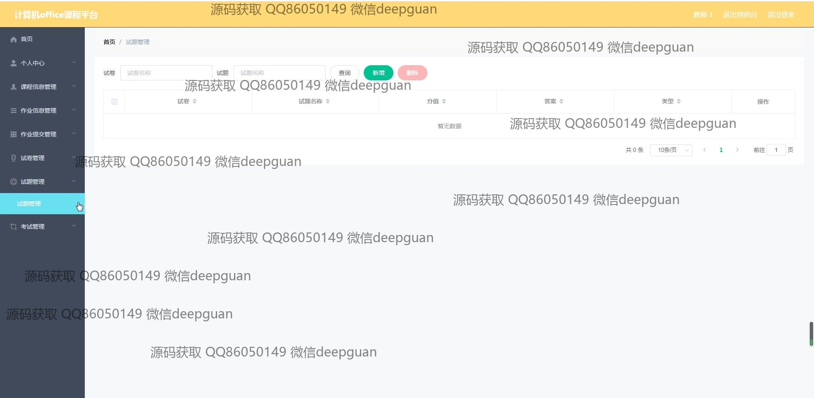
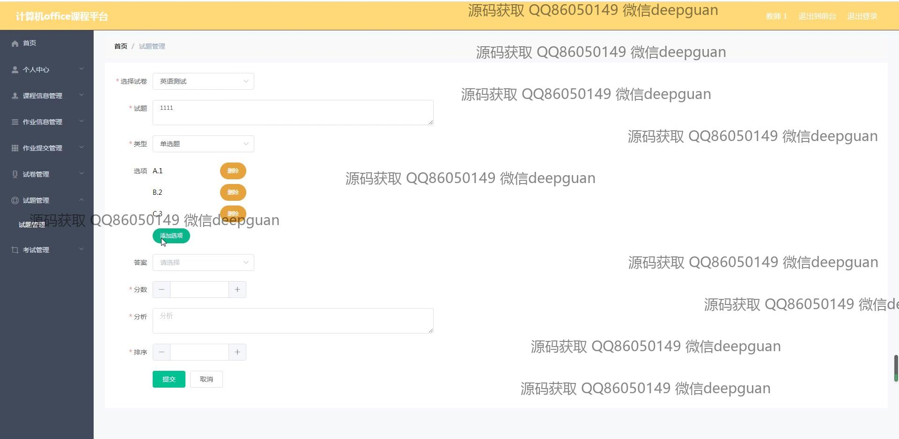

<h1 align="center">基于java web的计算机office课程平台设计与实现+vue</h1>

## 简介
计算机Office课程平台具备用户管理、课程信息管理、作业及试卷管理、在线论坛和个性化账户设置等功能，实现高效便捷的在线教育体验。    --计算机毕业设计源码；毕设源码；java毕业设计源码

## 联系方式

<h3 align="center">获取完整代码与数据库文件 + 微信：deepguan QQ: 86050149 QQ群: 783742310</h3>

<h3 align="center">可帮忙远程部署 包运行成功！提供远程部署、修改代码、设计文档指导、代码讲解等服务！</h3>

## 功能介绍（完整见运行截图）
管理员：可以管理学生和教师信息，处理课程类型和信息的管理，还包括作业信息、提交关系以及留言板和在线论坛的管理。能够进行试卷和考勤管理，拥有修改密码等系统管理权限，确保平台功能正常运行和内容的及时更新。

教师：主要负责课程信息管理，包括编辑课程内容和管理试卷。可以上传课程相关的图片、视频等文件，并利用论坛进行讨论和互动。此外，可以查看并回复学生的留言，发布和批改作业，并且访问评论区、视频播放等功能。

学生：通过导航菜单可以访问个人中心、课程信息、作业信息和公告等。支持作业提交、查看考试记录、参与论坛讨论和管理自己的收藏。学生可以通过界面对试卷和题库进行练习，上传作业，并浏览课程资源，确保学习的全面性和互动性。

访客：可以注册成为学生或教师，通过平台提供的注册界面简单注册并登录系统，接触到平台的基本信息和公告。在获取登录权限后，能够体验和使用平台提供的完整功能，利用丰富的资源进行学习和交流。

## 运行截图

本代码来源于网络,仅供学习参考使用!

